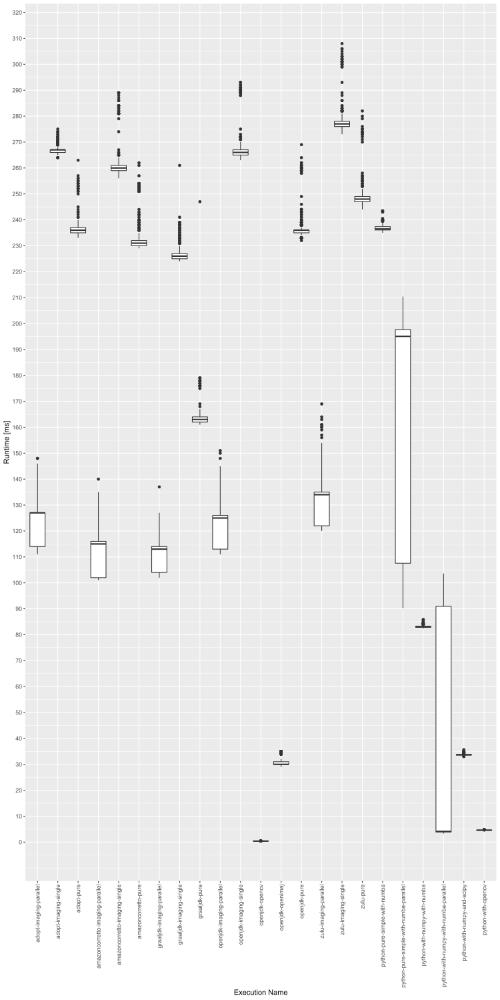

Python and C++ are the most common programming languages, when it comes to image processing and computer vision.
Especially, Python has grown more and more in this area in recent years. With this project we want to show that image
processing is not only limited to these programming languages. For this reason, we present a performance comparison of
Java and Python in the context of CPU based image processing, since GPU support is more or less limited to C++. The
comparison is done using pure programming language specific implementations without any additional frameworks as well as
comparisons based on state-of-the-art frameworks. In addition to that we also compare the implementations using
different interpreters. As foundation of the comparison we are using a simple kernel-based averaging filter on a
greyscale image.

In addition to the state-of-the-art frameworks we also compare the different implementations with
our [Imaging](https://github.com/FHOOEAIST/imaging) project.

The idea of this project is based on the comparison of [Pereira et. al](https://doi.org/10.1145/3136014.3136031) in the
context of energy efficiency across programming languages.

## Setup

Our test setup is composed of different Python and Java executions. In the course of this we do not only compare Java
and Python, but also different concepts in each Python and Java, as well as different runtime environments in Java. This
section will describe the different concepts and will show the different executions that are executed.

### Java

The main comparison in Java is between a pure Java-based implementation (compare Pure.java) and the implementation of
the [Imaging-Framework](https://github.com/FHOOEAIST/imaging). The pure implementation is using simple for-loops to
iterate through the image, whereas the Imaging-Framework is using multiple abstraction layers, to get a high advanced
software architecture. Behind that
the [Java Streaming API](https://docs.oracle.com/javase/8/docs/api/java/util/stream/package-summary.html) is utilized to
iterate the images. This also allows us, to easily execute the process in parallel.

Moreover, we are comparing that to other concepts
like [OpenCV filter2D](https://docs.opencv.org/master/d4/d86/group__imgproc__filter.html) as well as
[OpenImaJ FourierConvolve](http://openimaj.org/apidocs/org/openimaj/image/processing/convolution/FourierConvolve.html).
Please note, that these implementations rely on a different concept on how to apply the convolution filter.

### Python

In Python, we compare a pure Python-based implementation, with state-of-the-art frameworks
like [scipy](https://docs.scipy.org/doc/scipy/reference/generated/scipy.signal.convolve.html). In addition to that we
compare how the base array type performs in comparison with
the [numpy array](https://numpy.org/doc/stable/reference/generated/numpy.array.html). Moreover, we added the framework
[numba](https://numba.pydata.org/) to evaluate the performance utilizing JIT compilation. Finally, we are adding the
OpenCV filter2D in Python, to see how it performs there.

Every implementation was executed with 100 warmup runs and 1000 measured execution runs.

All of this now results in the following test-setup:

| Execution Name | Language | Framework | Parallel |
|-|-|-|-|
| adopt-imaging-parallel | Java 11 (AdoptOpenJDK) | Imaging | X |
| adopt-imaging-single | Java 11 (AdoptOpenJDK) | Imaging |  |
| adopt-pure | Java 11 (AdoptOpenJDK) | Pure Java |  |
| amazoncorretto-imaging-parallel | Java 11 (Amazon Corretto) | Imaging | X |
| amazoncorretto-imaging-single | Java 11 (Amazon Corretto) | Imaging |  |
| amazoncorretto-pure | Java 11 (Amazon Corretto) | Pure Java |  |
| graaljdk-imaging-parallel | Java 11 (GraalVM) | Imaging | X |
| graaljdk-imaging-single | Java 11 (GraalVM) | Imaging |  |
| graaljdk-pure | Java 11 (GraalVM) | Pure Java |  |
| openjdk-imaging-parallel | Java 11 (OpenJDK) | Imaging | X |
| openjdk-imaging-single | Java 11 (OpenJDK) | Imaging |  |
| openjdk-opencv | Java 11 (OpenJDK) | OpenCV (filter2d) |  |
| openjdk-openimaj | Java 11 (OpenJDK) | OpenImaJ (FourierConvolve) |  |
| openjdk-pure | Java 11 (OpenJDK) | Pure Java |  |
| zulu-imaging-parallel | Java 11 (Zulu OpenJDK) | Imaging | X |
| zulu-imaging-single | Java 11 (Zulu OpenJDK) | Imaging |  |
| zulu-pure | Java 11 (Zulu OpenJDK) | Pure Java |  |
| python-pure-simple (*) | Python 3.7.10 | Pure Python |  |
| python-with-itertools (*) | Python 3.7.10 | Itertools |  |
| python-pure-simple-with-numba | Python 3.7.10 | Numba |  |
| python-pure-simple-with-numba-parallel | Python 3.7.10 | Numba | X |
| python-itertools-with-numba | Python 3.7.10 | Itertools + Numba |  |
| python-with-numpy (*) | Python 3.7.10 | Numpy |  |
| python-with-numpy-with-numba | Python 3.7.10 | Numpy + Numba |  |
| python-with-numpy-with-numba-parallel | Python 3.7.10 | Numpy + Numba | X |
| python-with-numpy-and-scipy | Python 3.7.10 | Numpy + Scipy (convolve) |  |
| python-with-opencv | Python 3.7.10 | OpenCV (filter2d) |  |

(*) This implementation was executed with a reduced amout of runs (25 warmup and 100 measured executions), because of the huge time impact of a single run.

The setup was executed on a computer with:
- Windows 10
- AMD Ryzen 9 3900X 12-Core Processor
- 64GB RAM

using Docker 20.10.2 and a limitation to 4 CPU cores per run (see script.bat). None of the used implementations utilizes the computation power of a GPU.

## Results

| Execution Name | Avg | Median | Stdev | Min | Max |
|---|--:|--:|--:|--:|--:|
| adopt-imaging-parallel | 123.23 | 127.00 | 8.08 | 111.00 | 148.00 |
| adopt-imaging-single | 266.91 | 267.00 | 1.51 | 264.00 | 275.00 |
| adopt-plain | 236.23 | 236.00 | 3.08 | 233.00 | 263.00 |
| amazoncorretto-imaging-parallel | 110.96 | 115.00 | 7.27 | 101.00 | 140.00 |
| amazoncorretto-imaging-single | 260.64 | 260.00 | 4.10 | 256.00 | 289.00 |
| amazoncorretto-plain | 231.82 | 231.00 | 3.96 | 229.00 | 262.00 |
| graaljdk-imaging-parallel | 110.13 | 113.00 | 5.53 | 102.00 | 137.00 |
| graaljdk-imaging-single | 226.76 | 226.00 | 2.61 | 224.00 | 261.00 |
| graaljdk-plain | 163.37 | 163.00 | 3.61 | 161.00 | 247.00 |
| openjdk-imaging-parallel | 122.05 | 125.00 | 8.07 | 111.00 | 151.00 |
| openjdk-imaging-single | 266.25 | 266.00 | 4.09 | 263.00 | 293.00 |
| openjdk-opencv | 0.39 | 0.39 | 0.01 | 0.37 | 0.49 |
| openjdk-openimaj | 30.99 | 30.00 | 1.52 | 29.00 | 35.00 |
| openjdk-plain | 236.35 | 236.00 | 4.01 | 232.00 | 269.00 |
| zulu-imaging-parallel | 84.96 | 84.00 | 2.26 | 83.00 | 101.00 |
| zulu-imaging-single | 277.46 | 277.00 | 4.50 | 273.00 | 308.00 |
| zulu-plain | 248.50 | 248.00 | 4.41 | 244.00 | 282.00 |
| python-pure-simple | 14597.56 | 14521.56 | 228.28 | 14342.33 | 15254.21 |
| python-with-itertools | 13166.17 | 13155.98 | 31.02 | 13118.70 | 13239.89 |
| python-pure-simple-with-numba | 236.77 | 236.48 | 1.00 | 234.98 | 243.49 |
| python-pure-simple-with-numba-parallel | 159.98 | 195.07 | 45.43 | 90.25 | 210.42 |
| python-itertools-with-numba | 3355.02 | 3352.39 | 11.11 | 3334.98 | 3410.89 |
| python-with-numpy | 8622.70 | 8613.33 | 37.41 | 8557.27 | 8795.89 |
| python-with-numpy-with-numba | 83.09 | 83.01 | 0.34 | 82.45 | 85.86 |
| python-with-numpy-with-numba-parallel | 31.39 | 4.13 | 40.52 | 3.26 | 103.60 |
| python-with-numpy-and-scipy | 33.72 | 33.68 | 0.26 | 33.00 | 35.66 |
| python-with-opencv | 4.62 | 4.61 | 0.05 | 4.55 | 4.82 |

The following figure contains the measurments in form of a box plot diagram with the runtime in ms on the y-axis for the different implementations, that are listed on the x-axis. Note that `python-pure-simple`, `python-with-itertools`, `python-itertools-with-numba` and `python-with-numpy` are excluded, because of the non-comparable runtime of multiple seconds in average.

## Conclusion

First of all, the presented implementation of a convolution filter is not ideal at all, since convolutions can be implemented in a highly optimized way as shown with `openjdk-opencv`, `openjdk-openimaj`, `python-with-numpy-and-scipy` and `python-with-opencv`. But a pixel-wise read and write access of an image is a often required task in image processing and for this we have chosen this as foundation of our comparision. 

Refereing only to the Java implementations the comparision shows that the used JDK has an high impact to the actual runtime - independent of single or multi core usage. For this, it can be seen that the usage of Graal has a positive impact according to the runtime of the executed implementations. 

The implementations also show that classic approaches in the context of image processing using for loops to iterate the pixels of an image are not ideal with pure Python code (without using additional frameworks). In the case of many executions, this disadvantage can be bypassed using JIT compilition with `Numba`, that in turn leads to a high performance boost. 

The comparision of `openjdk-openimaj` and `python-with-numpy-and-scipy` shows, that there are nearly no performance differences between Java or Python if state-of-the-art image processing frameworks are used. Based on the comparision of the language specialized wrappers of the `OpenCV` framework Java's overhead of the native function call seems to highly outperform the Python version. 

## Getting Started

To reproduce the results just use the provided `script.bat` file and adapt the path to the folder that is mounted into the used
Docker containers.

### Requirements

This comparison uses Java and Python in a Docker environment. For this reason [Docker](https://www.docker.com/) is
required to execute the comparison on your own.

## Contributing

**First make sure to read our [general contribution guidelines](https://fhooeaist.github.io/CONTRIBUTING.html).**

## Licence

Copyright (c) 2021 the original author or authors. DO NOT ALTER OR REMOVE COPYRIGHT NOTICES.

This Source Code Form is subject to the terms of the Mozilla Public License, v. 2.0. If a copy of the MPL was not
distributed with this file, You can obtain one at https://mozilla.org/MPL/2.0/.

## Research

If you are going to use this project as part of a research paper, we would ask you to reference this project by citing
it.

<TODO zenodo doi>
